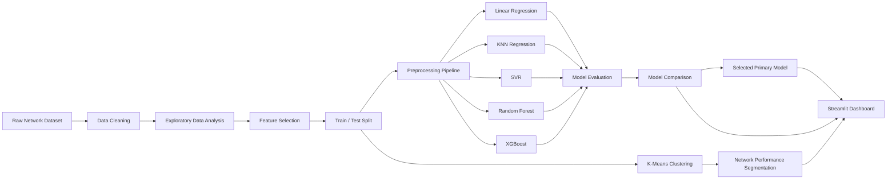
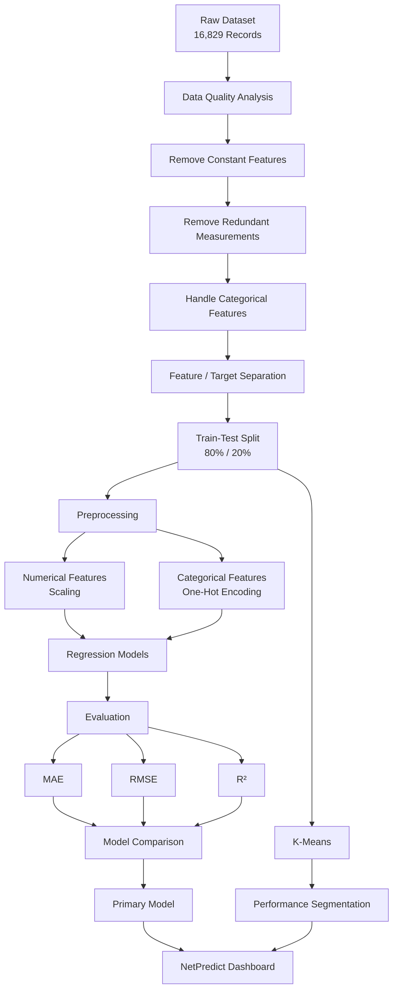
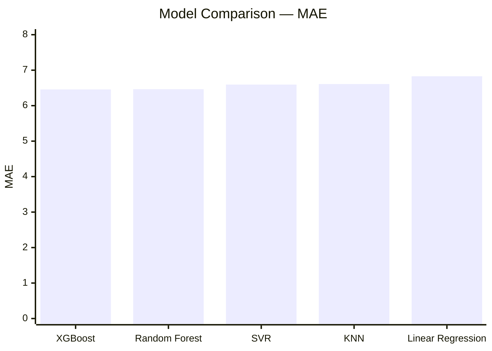
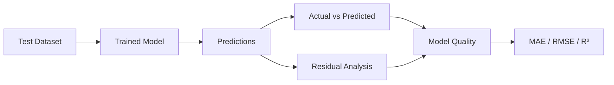
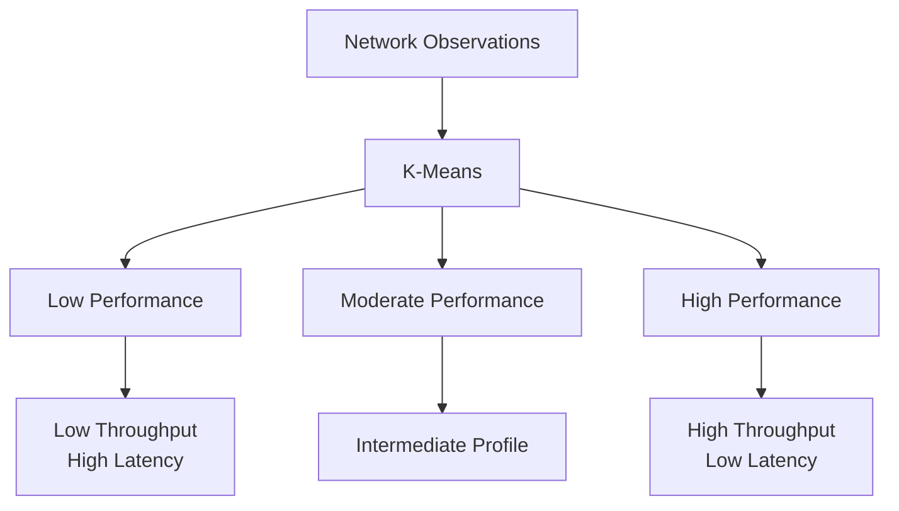

# 📡 NetPredict

### Mobile Network Throughput Prediction & Performance Analytics

> An end-to-end Machine Learning project for predicting network data throughput and analyzing network performance using supervised and unsupervised learning.
> Webapp link : https://nti-final-project-javkpt4buakqxoxz6c3wdl.streamlit.app/

<p align="center">
  
  
  
  
  
  
</p>

---

## 📌 Project Overview

**NetPredict** is an end-to-end Machine Learning application designed to analyze network conditions, predict **Data Throughput (Mbps)**, compare multiple regression models, and segment network conditions into performance groups.

The project combines:

* Exploratory Data Analysis
* Data preprocessing
* Feature engineering
* Regression
* Hyperparameter tuning
* Model evaluation
* Unsupervised learning
* Model comparison
* Interactive visualization
* Streamlit deployment

The final result is an interactive dashboard that allows users to:

1. Predict expected network throughput.
2. Compare different Machine Learning models.
3. Analyze network performance patterns.
4. Explore K-Means performance segments.
5. Evaluate model predictions and residuals.

---

# 🎯 Problem Statement

Network performance depends on multiple factors such as:

* Signal strength
* Latency
* Geographic location
* Network technology
* Other measured network characteristics

The goal of this project is to build Machine Learning models capable of estimating:

> **Data Throughput (Mbps)**

based on available network conditions.

The project also aims to identify different **network performance profiles** using unsupervised learning.

---

# 🏗️ System Architecture



---

# 🔄 Machine Learning Workflow



---

# 📊 Dataset

The dataset contains **16,829 network observations**.

### Original Features

| Feature                        | Description                     |
| ------------------------------ | ------------------------------- |
| `Timestamp`                    | Measurement timestamp           |
| `Locality`                     | Geographic/locality information |
| `Latitude`                     | Geographic latitude             |
| `Longitude`                    | Geographic longitude            |
| `Signal Strength (dBm)`        | Measured signal strength        |
| `Signal Quality (%)`           | Signal quality percentage       |
| `Data Throughput (Mbps)`       | **Target variable**             |
| `Latency (ms)`                 | Network latency                 |
| `Network Type`                 | Network technology              |
| `BB60C Measurement (dBm)`      | Signal measurement              |
| `srsRAN Measurement (dBm)`     | Signal measurement              |
| `BladeRFxA9 Measurement (dBm)` | Signal measurement              |

---

# 🧹 Data Preprocessing

The preprocessing stage focused on improving data quality while avoiding unnecessary feature removal.

### Removed Features

#### `Signal Quality (%)`

The feature contained a constant value and therefore provided no useful information for the models.

#### Hardware Measurement Features

The following measurements were highly redundant:

```text
BB60C Measurement (dBm)
srsRAN Measurement (dBm)
BladeRFxA9 Measurement (dBm)
```

Their extremely high correlation indicated that they contained largely overlapping information.

#### `Timestamp`

The timestamp was removed because exploratory analysis did not reveal a sufficiently useful temporal pattern for the modeling objective.

---

## Feature Preparation

The final model inputs consisted of:

### Numerical Features

```text
Latitude
Longitude
Signal Strength (dBm)
Latency (ms)
```

### Categorical Features

```text
Locality
Network Type
```

### Target

```text
Data Throughput (Mbps)
```

The network labels were also standardized by merging:

```text
LTE → 4G
```

resulting in:

```text
4G
3G
5G
```

---

# 🔐 Leakage-Free Preprocessing

The project uses `Pipeline` and `ColumnTransformer` to ensure preprocessing is learned only from the training data.

```python
preprocessor = ColumnTransformer(
    transformers=[
        ("num", StandardScaler(), numerical_features),
        ("cat", OneHotEncoder(handle_unknown="ignore"), categorical_features)
    ]
)
```

This provides two important advantages:

* Consistent preprocessing during training and prediction.
* Protection against data leakage from the test set.

---

# 🤖 Machine Learning Models

Five regression algorithms were implemented and evaluated.

| Model             | Main Idea                                           |
| ----------------- | --------------------------------------------------- |
| Linear Regression | Linear relationship between features and throughput |
| KNN Regressor     | Predicts using nearby observations                  |
| SVR               | Learns a flexible regression boundary               |
| Random Forest     | Ensemble of decision trees                          |
| XGBoost           | Gradient boosting with sequential tree optimization |

---

# 📈 Model Performance

The models were evaluated using:

* **MAE** — Mean Absolute Error
* **RMSE** — Root Mean Squared Error
* **R²** — Coefficient of Determination

### Final Test Results

| Rank | Model             |      MAE ↓ |      RMSE ↓ |       R² ↑ |
| ---: | ----------------- | ---------: | ----------: | ---------: |
| 🥇 1 | **XGBoost**       | **6.4581** |     13.3298 |     0.7359 |
| 🥈 2 | Random Forest     |     6.4640 |     13.3387 |     0.7355 |
| 🥉 3 | SVR               |     6.5950 |     13.3597 |     0.7347 |
|    4 | KNN               |     6.6088 |     13.4226 |     0.7322 |
|    5 | Linear Regression |     6.8287 | **13.3191** | **0.7363** |

### Model Comparison



> Lower MAE indicates better average absolute prediction error.

---

# 🏆 Model Selection

**XGBoost** was selected as the primary model because it achieved the **lowest MAE** among the evaluated models.

However, model performance is not identical across all metrics.

* **XGBoost** achieved the lowest MAE.
* **Linear Regression** achieved slightly lower RMSE.
* **Linear Regression** also achieved slightly higher R².
* Overall model performance was relatively close.

Therefore, XGBoost was selected primarily according to the project's focus on minimizing average absolute prediction error.

---

# 📐 Evaluation Metrics

## MAE

Mean Absolute Error measures the average absolute difference between actual and predicted values.

A lower MAE means predictions are closer to the actual throughput values on average.

---

## RMSE

RMSE gives higher importance to larger prediction errors.

A lower RMSE indicates fewer large prediction deviations.

---

## R²

R² measures how much of the variation in the target is explained by the model.

A value closer to `1` indicates stronger explanatory performance.

---

# 🧠 Model Evaluation

The dashboard provides detailed evaluation for each regression model, including:

* Actual vs Predicted values
* Residual analysis
* MAE
* RMSE
* R²
* Mean residual
* Residual standard deviation
* Maximum absolute residual

### Evaluation Concept



---

# 🧩 Network Performance Segmentation

In addition to supervised regression, **K-Means Clustering** was used to discover groups of network observations with similar performance characteristics.

Three clusters were identified.

| Cluster | Performance Level    | Signal Strength | Throughput |   Latency |
| ------: | -------------------- | --------------: | ---------: | --------: |
|       0 | Low Performance      |      -86.47 dBm |  2.12 Mbps | 153.21 ms |
|       1 | High Performance     |      -95.82 dBm | 62.98 Mbps |  29.61 ms |
|       2 | Moderate Performance |      -91.27 dBm |  7.56 Mbps |  77.90 ms |

### Performance Profiles



> Cluster labels represent observed profiles in the dataset. They should not be interpreted as direct causal relationships between individual features and network performance.

---

# 📊 Key Network Insight

The clustering analysis revealed clear differences in network performance profiles.

The most important distinction between the identified groups was the combination of:

```text
Throughput
Latency
Signal characteristics
```

The high-performance cluster showed substantially higher throughput and lower latency than the other groups.

---

# 🖥️ NetPredict Dashboard

The final application was built using **Streamlit**.

## Dashboard Sections

### 1. Overview

Provides:

* Dataset statistics
* Model performance summary
* Primary model insight
* Project objective
* High-level analytics

---

### 2. Prediction

Users can provide:

```text
Locality
Latitude
Longitude
Network Type
Signal Strength
Latency
```

The dashboard then predicts:

> **Data Throughput (Mbps)**

The prediction page also displays the corresponding network performance profile.

---

### 3. Model Comparison

Provides:

* Model ranking
* MAE comparison
* RMSE comparison
* R² comparison
* Best-performing models
* Performance insights

---

### 4. Network Segmentation

Provides:

* Cluster profiles
* Throughput comparison
* Latency comparison
* Interactive cluster prediction
* Performance-level classification

---

### 5. Model Evaluation

Provides:

* Actual vs Predicted visualization
* Residual analysis
* Model metrics
* Residual distribution
* Error statistics

---

### 6. About

Contains:

* Project description
* ML workflow
* Models used
* Technologies
* Project information

---

# 📸 Dashboard Preview

> Add screenshots of the final Streamlit dashboard here.

Recommended structure:

```text
docs/
└── images/
    ├── overview.png
    ├── prediction.png
    ├── model-comparison.png
    ├── segmentation.png
    └── evaluation.png
```

Then add:

```markdown
## Dashboard Preview

### Overview


### Prediction


### Model Comparison


### Network Segmentation


### Model Evaluation


```

---

# 🗂️ Project Structure

```text
NTI-Final-Project/
│
├── data/
│   ├── raw/
│   │   └── dataset.csv
│   │    
│   └── processed/
│       ├── processed_data.csv
│       ├── X_test.csv
│       ├── y_train.csv
│       ├── y_train.csv
│       └── y_test.csv
│
├── notebooks/
│   ├── 01_EDA.ipynb
│   ├── 02_Preprocessing.ipynb
│   ├── 03_Linear_Regression.ipynb
│   ├── 04_KNN.ipynb
│   ├── 05_SVR.ipynb
│   ├── 06_Random_Forest.ipynb
│   ├── 07_XGBoost.ipynb
│   ├── 08_KMeans.ipynb
│   └── 09_Model_Comparison.ipynb
│
├── models/
│   ├── linear_regression.joblib
│   ├── knn.joblib
│   ├── svr.joblib
│   ├── random_forest.joblib
│   ├── xgboost.joblib
│   └── kmeans.joblib
│
├── app/
│   ├── app.py
│   └── assets/
│
├── requirements.txt
│
└── README.md
```

---

# ⚙️ Technologies

### Programming

* Python

### Data Analysis

* Pandas
* NumPy

### Visualization

* Matplotlib
* Seaborn
* Streamlit charts

### Machine Learning

* Scikit-Learn
* XGBoost

### Model Persistence

* Joblib

### Application

* Streamlit

### Development

* Jupyter Notebook
* PyCharm
* Git
* GitHub

---

# 🚀 Installation

## 1. Clone the Repository

```bash
git clone https://github.com/MohamedAAbdullah1/NTI-Final-Project
cd NTI-Final-Project
```

---

## 2. Create a Virtual Environment

```bash
python3 -m venv .venv
```

Activate it:

### Linux / macOS

```bash
source .venv/bin/activate
```

### Windows

```bash
.venv\Scripts\activate
```

---

## 3. Install Dependencies

```bash
pip install -r requirements.txt
```

---

# ▶️ Run the Application

From the project root:

```bash
streamlit run app/app.py
```

The application will start locally and provide a URL similar to:

```text
http://localhost:8501
```

---

# 🔬 Reproducing the Project

The notebooks are organized according to the Machine Learning workflow.

Recommended execution order:

```text
01_EDA
   ↓
02_Preprocessing
   ↓
03_Linear_Regression
   ↓
04_KNN
   ↓
05_SVR
   ↓
06_Random_Forest
   ↓
07_XGBoost
   ↓
08_KMeans
   ↓
09_Model_Comparison
```

The preprocessing notebook creates the shared train/test datasets used by the modeling notebooks.

---

# 🔒 Reproducibility

The project uses fixed random states where applicable:

```python
RANDOM_STATE = 42
```

This helps maintain consistent train/test splits and reproducible model behavior.

---

# 📦 Saved Models

Trained models are persisted using `joblib`.

```text
models/
├── linear_regression.joblib
├── knn.joblib
├── svr.joblib
├── random_forest.joblib
├── xgboost.joblib
└── kmeans.joblib
```

This allows the Streamlit application to load trained models directly without retraining them during every application startup.

---

# 💡 Key Takeaways

### 1. XGBoost achieved the lowest MAE

The XGBoost model achieved:

```text
MAE = 6.4581 Mbps
```

making it the primary model for the dashboard.

---

### 2. Tree-based models performed competitively

Random Forest and XGBoost produced very similar results, indicating that both ensemble approaches captured useful nonlinear patterns in the dataset.

---

### 3. Different metrics can produce different rankings

No single metric should be considered in isolation.

The models showed slightly different behavior across:

```text
MAE
RMSE
R²
```

Therefore, model selection was based primarily on the project's main objective rather than claiming one model was universally superior.

---

### 4. Network observations form distinct performance profiles

K-Means revealed three interpretable network performance groups:

```text
Low Performance
Moderate Performance
High Performance
```

These profiles provide an additional analytical perspective beyond throughput prediction.

---

# ⚠️ Limitations

Although the project demonstrates a complete ML workflow, several limitations remain.

### Dataset Limitations

The model is dependent on the available network measurements and their quality.

### Generalization

Performance on unseen environments, locations, or network infrastructures may differ from the reported test-set results.

### Feature Availability

The prediction system only uses features available in the project dataset.

### Regression Error

The models still produce non-zero prediction errors, meaning throughput predictions should be treated as estimates rather than exact measurements.

### Clustering Interpretation

K-Means clusters describe patterns in the observed data but do not establish causal relationships.

---

# 🔮 Future Improvements

Possible future improvements include:

* Collecting larger and more geographically diverse datasets.
* Adding additional network-quality indicators.
* Performing more advanced feature engineering.
* Testing additional boosting algorithms.
* Applying cross-validation more extensively.
* Adding explainable AI techniques such as SHAP.
* Adding geospatial network-performance maps.
* Monitoring prediction drift over time.
* Deploying the application to a cloud platform.
* Building an API layer for external applications.
* Adding real-time network measurements.

---

# 🧠 Project Learning Outcomes

Through this project, the following Machine Learning concepts were applied:

```text
Data Cleaning
      ↓
Exploratory Data Analysis
      ↓
Feature Selection
      ↓
Data Preprocessing
      ↓
Train/Test Split
      ↓
Regression
      ↓
Hyperparameter Tuning
      ↓
Model Evaluation
      ↓
Model Comparison
      ↓
Clustering
      ↓
Model Deployment
      ↓
Interactive Dashboard
```

The project therefore covers the complete lifecycle from **raw data to an interactive ML application**.

---

# 🏁 Project Outcome

NetPredict demonstrates how Machine Learning can be used to transform raw network measurements into an interactive analytics and prediction system.

The project combines:

> **Prediction + Evaluation + Segmentation + Visualization + Deployment**

into a single application.

The final system provides both a predictive perspective through regression models and an analytical perspective through network performance segmentation.

---

# 👨‍💻 Author

**Mohamed Abdullah**
**Ahmed Mohamed Mahmoud**
**Azza Hossam Yehia**
**Merna Nady Narouz**
**Shahd Reda Gohary**
---

# ⭐ Acknowledgment

This project was developed as part of the **NTI Machine Learning training program** and represents an applied Machine Learning project covering data analysis, supervised learning, unsupervised learning, evaluation, and deployment.

---

# 📄 License

This project is intended for educational and portfolio purposes.

If you use or extend this project, please provide appropriate attribution.
